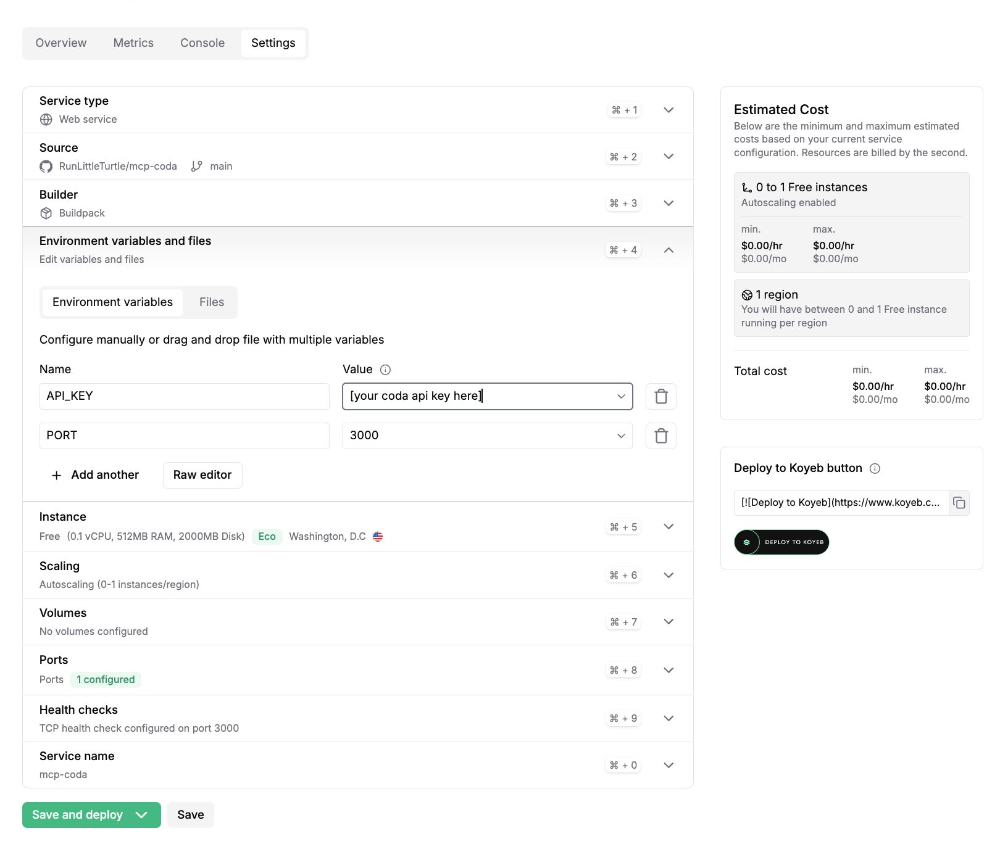
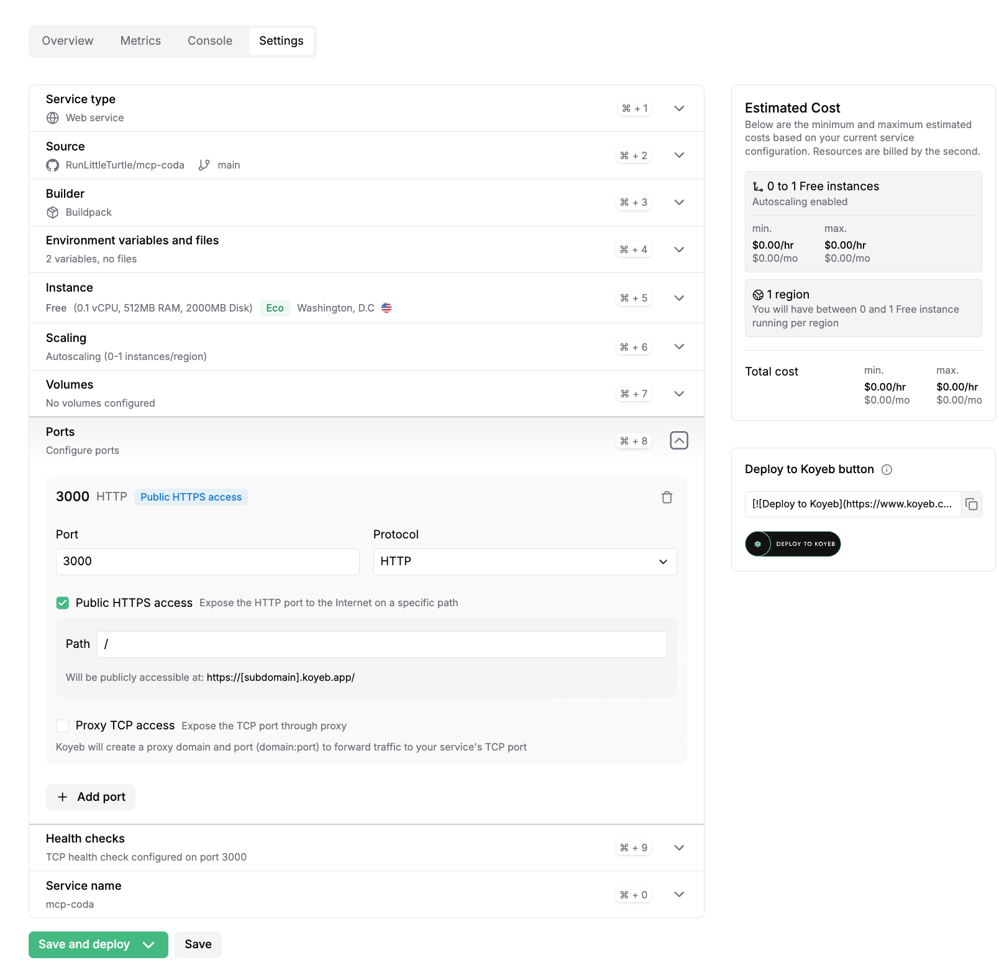
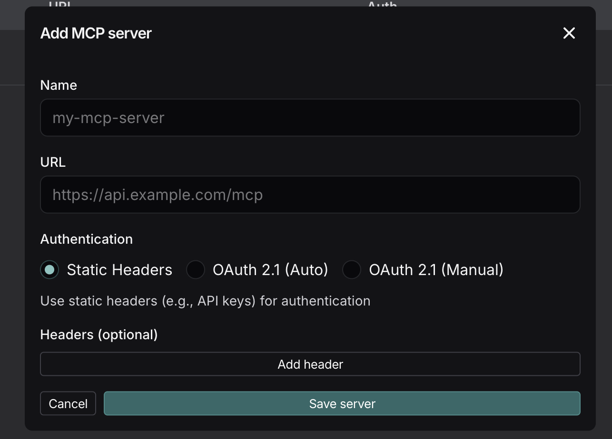

# Coda MCP Server (Koyeb + LangSmith)

This repo runs a Coda MCP server with:
- Streamable HTTP endpoint: `/mcp` (recommended)
- Legacy SSE endpoint: `/sse`

## Quick Start (Koyeb First)

### 1. Fork or use this repo on GitHub

Use this repository in your own GitHub account (for example `RunLittleTurtle/mcp-coda`).

### 2. Create a Koyeb account and connect GitHub

In Koyeb:
1. Create a new **Web service**
2. Select your GitHub repo and `main` branch
3. Keep **Buildpack** as builder
4. Choose **Free / CPU Eco** instance

### 3. Set environment variables

Add these variables in Koyeb:
- `API_KEY` = your Coda API key
- `PORT` = `3000`



### 4. Configure port

In Koyeb Ports:
- Port: `3000`
- Protocol: `HTTP`
- Public HTTPS access: enabled



### 5. Deploy

Click **Save and deploy**.

After deploy, your public URL will look like:
- `https://your-service-name.koyeb.app`

Health check:
- `https://your-service-name.koyeb.app/health`

MCP endpoint:
- `https://your-service-name.koyeb.app/mcp`

## LangSmith Agent Builder Setup

Add an MCP server with:
- **Name**: `mcp-coda` (or your preferred name)
- **URL**: `https://your-service-name.koyeb.app/mcp`
- **Authentication**: `Static Headers`
- **Headers**: none



Important:
- Use `/mcp` (not `/` and not `/sse` in Agent Builder)
- If tools do not appear after a redeploy, wait a few seconds and reload Agent Builder

## Local (minimal)

```bash
pnpm install
pnpm build
echo "API_KEY=your-coda-key" > .env
PORT=3000 pnpm start:http
```

Then test:
- `http://localhost:3000/health`
- `http://localhost:3000/mcp`

## Environment variables

- `API_KEY` or `CODA_API_KEY` (required)
- `PORT` (optional, default `3000`)

## Credits

- Original project: [dustinrgood/coda-mcp](https://github.com/dustinrgood/coda-mcp)
- Early fork lineage: [orellazri/coda-mcp](https://github.com/orellazri/coda-mcp)

## License

MIT
